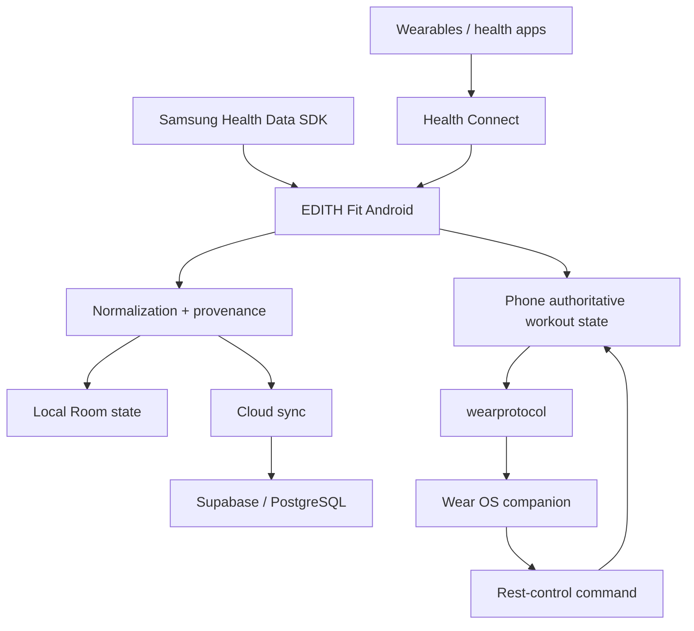

# EDITH Fit — Engineering Showcase

**Android · dati wearable · sincronizzazione · validazione su dispositivi reali**

[**English**](README.md) · **Italiano**

EDITH Fit è una piattaforma personale Android per salute, wearable e dati di allenamento sviluppata all'interno di **EDITH Dev Studio**.

Questa repository è un'edizione ingegneristica curata di un progetto privato più ampio. Contiene architettura, evidenze di verifica e codice rappresentativo senza pubblicare dati sanitari personali, segreti del backend o l'applicazione completa.

## Problema ingegneristico

I dati salute/wearable attraversano più confini:

- applicazioni differenti
- dispositivi differenti
- schemi differenti
- semantiche di aggiornamento differenti
- clock e identificatori differenti
- distribuzione dello stato telefono ↔ orologio

EDITH Fit si concentra quindi su **normalizzazione, provenance, sincronizzazione e stato autorevole**, invece di appiattire tutto in metriche anonime.

## Stack

- Kotlin / Android
- Health Connect
- Samsung Health Data SDK
- Room
- WorkManager
- Wear OS
- Wearable Data Layer
- Kotlin coroutines / Flow
- Supabase / PostgreSQL
- test automatici unitari + strumentati

## Architettura



## Aree implementate e verificate

### Ingestion da Health Connect

Il progetto ha validato fisicamente l'accesso a dati di attività, workout, frequenza cardiaca, resting HR, misure corporee, sonno/fasi e SpO2 mantenendo la provenance della sorgente.

### Sincronizzazione persistente

Comportamenti implementati:

- import storico
- elaborazione incrementale delle modifiche Health Connect
- upsert idempotenti
- gestione ordinata UPSERT/DELETE
- gestione token/stato di sincronizzazione
- coordinamento foreground/manual/background
- propagazione della cancellazione
- Row Level Security nello schema cloud

### Validazione Samsung Health

L'SDK ufficiale Samsung Health Data è stato integrato e testato su hardware Samsung fisico per telemetrie selezionate tra cui:

- composizione corporea
- energy score
- sonno/fasi
- serie temporali della temperatura cutanea
- provenance del dispositivo
- paginazione incrementale delle modifiche

Un esperimento di correlazione tra provider ha verificato deliberatamente se gli identificatori Samsung sopravvivono nel passaggio attraverso Health Connect. Nei record testati è stato osservato allineamento temporale, ma non un ponte diretto degli identificatori.

### Sincronizzazione telefono ↔ Wear OS

L'architettura workout attuale usa:

- modulo protocollo condiviso in puro Kotlin
- persistenza autorevole lato telefono
- numeri di revisione monotoni
- snapshot Data Layer
- comandi a bassa latenza dall'orologio
- acknowledgement
- barriera di riconciliazione che mantiene i controlli dell'orologio disabilitati finché non è arrivato uno snapshot autorevole

## Snapshot di verifica

Revisione sorgente usata per questo showcase:

```text
367f3875cc93df62b2a97b8eee6bc78babedba72
```

Il record di verifica della Phase 3C.7 documenta:

- `:wearprotocol`: **8** unit test superati
- `:app:testDebugUnitTest`: **191** unit test superati
- `:wear:testDebugUnitTest`: **34** unit test superati
- `:app:connectedDebugAndroidTest`: **54** test strumentati superati su telefono Samsung fisico
- build debug/release di app + wear superate
- lint app + wear superato con 0 errori
- `git diff --check` pulito

Il gate end-to-end con telefono/orologio accoppiati **non era stato eseguito** in quel momento perché nessun dispositivo Wear OS o emulatore era connesso. Questo limite viene mantenuto esplicito invece di presentarlo come validazione completata.

## Perché la provenance è importante

I record normalizzati possono mantenere:

- applicazione sorgente
- produttore/modello del dispositivo
- identificatori sorgente
- timestamp
- metadata di registrazione

Questo rende deduplicazione, debugging e analisi successive più sicuri.

## Codice selezionato

- [PhoneWearSyncCoordinator.kt](samples/PhoneWearSyncCoordinator.kt) — pubblicazione revisionata dello stato autorevole
- [ProvenanceMappingTest.kt](samples/ProvenanceMappingTest.kt) — esempio mirato di preservazione della provenance

## Documentazione

- [Data pipeline](docs/DATA_PIPELINE.md)
- [Real-device validation](docs/REAL_DEVICE_VALIDATION.md)
- [Wear synchronization](docs/WEAR_SYNC.md)
- [Verification evidence](docs/VERIFICATION.md)
- [Source provenance](docs/SOURCE_PROVENANCE.md)
- [Public scope](docs/PUBLIC_SCOPE.md)

## Link

- Engineering portfolio: https://github.com/Aceishere66/engineering-portfolio
- EDITH Dev Studio engineering page: https://edithdevstudio.com/engineering
