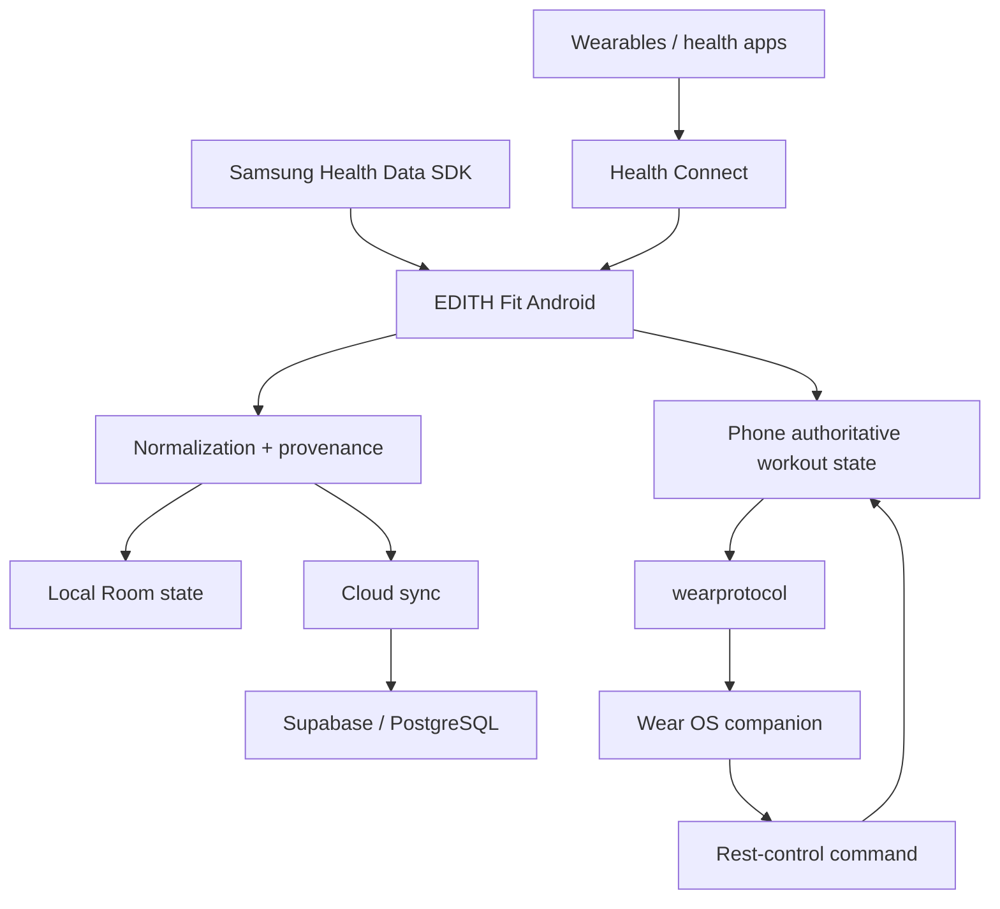

# EDITH Fit — Engineering Showcase

[**English**](README.md) · [Italiano](README.it.md)

**Android · wearable data · synchronization · real-device validation**

EDITH Fit is a personal Android health, wearable and workout-data platform developed within **EDITH Dev Studio**.

This repository is a curated engineering edition of a larger private project. It contains architecture, verification evidence and representative source without publishing personal health records, backend secrets or the complete application.

## Engineering problem

Health and wearable data crosses multiple boundaries:

- different applications
- different devices
- different schemas
- different update semantics
- different clocks and identifiers
- phone ↔ watch state distribution

EDITH Fit therefore focuses on **normalization, provenance, synchronization and authoritative state** rather than flattening everything into anonymous metrics.

## Stack

- Kotlin / Android
- Health Connect
- Samsung Health Data SDK
- Room
- WorkManager
- Wear OS
- Wearable Data Layer
- Kotlin coroutines / Flow
- Supabase / PostgreSQL
- automated unit + instrumented tests

## Architecture



## Implemented and verified areas

### Health Connect ingestion

The project has physically validated access to activity, workout, heart-rate, resting-heart-rate, body, sleep/stage and SpO2 data while retaining source provenance.

### Persistent synchronization

Implemented behaviors include:

- historical import
- incremental Health Connect change processing
- idempotent upserts
- ordered UPSERT/DELETE handling
- sync-token/state management
- foreground/manual/background coordination
- cancellation propagation
- Row Level Security in the cloud schema

### Samsung Health validation

The official Samsung Health Data SDK was integrated and tested on physical Samsung hardware for selected richer telemetry including:

- body composition
- energy score
- sleep/stages
- skin-temperature time series
- device provenance
- incremental change pagination

A cross-provider correlation experiment deliberately tested whether Samsung identifiers survive through Health Connect. On the tested records, timestamp alignment was observed, but a direct identifier bridge was not.

### Phone ↔ Wear OS synchronization

The current workout architecture uses:

- a pure Kotlin shared protocol module
- phone-authoritative persistence
- monotonic revision numbers
- Data Layer snapshots
- low-latency watch commands
- acknowledgements
- a reconciliation barrier that keeps watch controls gated until an authoritative snapshot has actually arrived

## Verification snapshot

Source snapshot used for this showcase:

```text
367f3875cc93df62b2a97b8eee6bc78babedba72
```

The Phase 3C.7 verification record at this source state documents:

- `:wearprotocol`: **8** unit tests passing
- `:app:testDebugUnitTest`: **191** unit tests passing
- `:wear:testDebugUnitTest`: **34** unit tests passing
- `:app:connectedDebugAndroidTest`: **54** instrumented tests passing on a physical Samsung phone
- app + wear debug/release assembly passing
- app + wear lint passing with 0 errors
- `git diff --check` clean

The paired phone/watch end-to-end device gate was **not executed** at that point because no Wear OS device or emulator was connected. That limitation is preserved explicitly rather than being presented as completed validation.

## Why provenance matters

Normalized records can preserve:

- source application
- device manufacturer/model
- source identifiers
- timestamps
- recording metadata

That makes deduplication, debugging and later analysis safer.

## Selected source

- [PhoneWearSyncCoordinator.kt](samples/PhoneWearSyncCoordinator.kt) — revisioned authoritative state publication
- [ProvenanceMappingTest.kt](samples/ProvenanceMappingTest.kt) — focused provenance-preservation example

## Documentation

- [Data pipeline](docs/DATA_PIPELINE.md)
- [Real-device validation](docs/REAL_DEVICE_VALIDATION.md)
- [Wear synchronization](docs/WEAR_SYNC.md)
- [Verification evidence](docs/VERIFICATION.md)
- [Source provenance](docs/SOURCE_PROVENANCE.md)
- [Public scope](docs/PUBLIC_SCOPE.md)

## Links

- Engineering portfolio: https://github.com/Aceishere66/engineering-portfolio
- EDITH Dev Studio engineering page: https://edithdevstudio.com/engineering/
